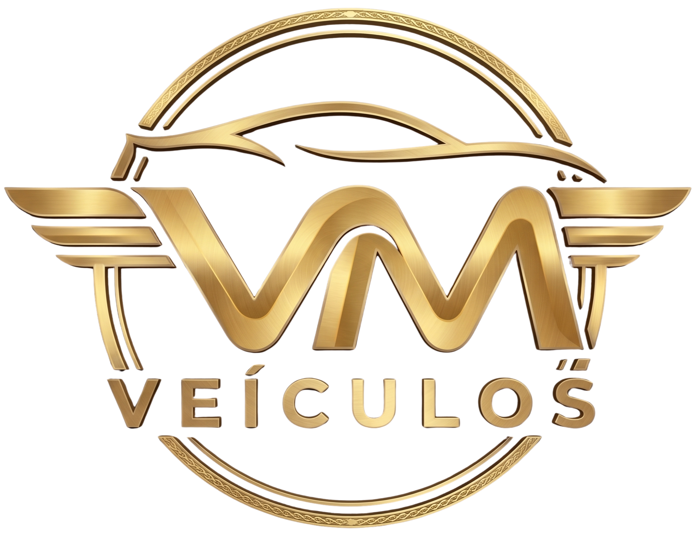

<div align="center">

  

  # 🚗 VM Veículos — Vitória da Conquista

  **Plataforma Web de Estoque Automotivo de Alta Conversão**

  [](https://nextjs.org/)
  [](https://react.dev/)
  [](https://www.typescriptlang.org/)
  [](https://github.com/css-modules/css-modules)

</div>

---

## 📌 Sobre o Projeto

O **VM Veículos** é uma solução web moderna desenvolvida para a concessionária e revenda de automóveis **VM Veículos**, localizada em Vitória da Conquista - BA. 

O projeto foi projetado com foco total em **UX/UI intuitiva**, **carregamento ultra-rápido** e **alta taxa de conversão**, direcionando potenciais compradores diretamente ao atendimento via WhatsApp de forma ágil e sem fricção.

---

## ✨ Principais Funcionalidades

- 🚘 **Catálogo Dinâmico de Estoque:** Listagem de veículos com tags de destaque, busca por código único (ex: `VM-001`), modelo ou marca.
- 🏷️ **Selo de Carro Vendido:** Indicador visual inteligente e sobreposição (*overlay*) fosca para veículos já comercializados, gerando prova social.
- 🖼️ **Galeria Interativa & Carrossel Suave:** Troca automática de fotos a cada 4 segundos com opção de pausa ao interagir.
- 🔍 **Lightbox / Modal de Imagens:** Visualização ampliada em alta resolução com navegação por setas e contador.
- 📱 **Totalmente Responsivo:** Design adaptado com menu gaveta (*hambúrguer*) otimizado para dispositivos móveis.
- 💬 **Integração WhatsApp Direct:** Links com mensagens pré-formatadas contendo o nome, ano, valor e código do veículo de interesse.
- 🎯 **Indicador "(à vista)":** Transparência nos preços alinhando a expectativa do comprador.

---

## 🛠️ Tecnologias Utilizadas

- **Framework:** [Next.js](https://nextjs.org/) (App Router & Client Components)
- **Biblioteca Base:** [React](https://react.dev/)
- **Linguagem:** [TypeScript](https://www.typescriptlang.org/)
- **Estilização:** CSS Modules (Variáveis CSS globais para tema Dark/Dourado)
- **Ícones:** [Lucide React](https://lucide.dev/)

---

## 📁 Estrutura de Pastas do Projeto

```text
vm-veiculos/
├── public/                 # Imagens estáticas (logos, ícones)
├── src/
│   ├── app/
│   │   ├── carro/[id]/     # Página dinâmica de detalhes do veículo
│   │   ├── vender/         # Página "Quero Vender Meu Carro"
│   │   ├── components/     # Componentes reutilizáveis (Header, Footer, CarCard, etc.)
│   │   ├── data/           # Schema de dados e mock do estoque (carros.ts)
│   │   ├── layout.tsx      # Layout global da aplicação
│   │   ├── page.tsx        # Página inicial (Home / Estoque)
│   │   └── page.module.css # Estilos da Hero e Grid da Home
└── README.md               # Documentação do projeto